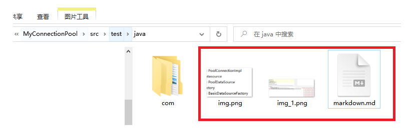
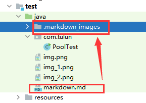

### TestMD


1. gfdgfdgf
   1. fvgfgf
      1. ffg

> 测试图片
可直接粘贴进来，底层和md文件在同意目录下



测试PasteImagesIntoMarkdown插件



```java

package com.tulun.pool;

import com.tulun.connection.PoolConnectionImpl;
import com.tulun.datasource.PoolDataSource;

import java.sql.Connection;
import java.sql.SQLException;
import java.util.Date;
import java.util.Iterator;
import java.util.concurrent.*;

/**
 * 描述: 连接池实现的主类
 */
public class ConnectionPoolImpl {
   // 连接数据库用的数据源信息
   private PoolDataSource poolDataSource;

   // 用来记录maxidletime超时时间，释放多余的连接，连接池保证初始连接量就可以
   private ScheduledExecutorService idleTimeTask;

   // 存储initPoolSize的连接，因为连接池最起码保证这些连接是存活的，因此单独存放
   private ConcurrentLinkedQueue<PoolConnectionImpl> initSizeConnQueue;

   // 存储连接池中额外生成的连接，由于这里面的连接超时以后，需要回收，因此使用高并发链表存储
   private ConcurrentLinkedQueue<PoolConnectionImpl> maxSizeConnQueue;

   // 通过数据源构造连接池对象，初始化数据成员
   public ConnectionPoolImpl(PoolDataSource poolDataSource) {
      this.poolDataSource = poolDataSource;
      this.idleTimeTask = Executors.newSingleThreadScheduledExecutor(new ThreadFactory() {
         @Override
         public Thread newThread(Runnable r) {
            Thread t = Executors.defaultThreadFactory().newThread(r);
            t.setDaemon(true); // 设置线程池为守护线程，系统退出自动回收线程池资源
            return t;
         }
      });
      this.initSizeConnQueue = new ConcurrentLinkedQueue<>();
      this.maxSizeConnQueue = new ConcurrentLinkedQueue<>();
   }

   // 初始化连接池功能  在构造函数中将线程池初始化为守护线程
   public void init() {
      // 根据配置的最大空闲时间，启动定时清理连接池的任务；通过守护线程启动线程池，进程关闭资源自动回收
      idleTimeTask.scheduleAtFixedRate(new CleanPoolTask(),
              poolDataSource.getMaxIdleTime(),
              poolDataSource.getMaxIdleTime(),
              TimeUnit.SECONDS);

      // 创建初始的连接
      for (int i = 0; i < poolDataSource.getInitPoolSize(); ++i) {
         initSizeConnQueue.add(new PoolConnectionImpl());
         System.out.println("创建新的连接");
      }
   }

   /**
    * 定时清理连接池的任务   启动一个守护线程定时清理连接池
    */
   private class CleanPoolTask implements Runnable {

      @Override
      public void run() {
         System.out.println("执行连接池释放空闲连接的任务!");
         Iterator<PoolConnectionImpl> it = maxSizeConnQueue.iterator();
         while (it.hasNext()) {
            PoolConnectionImpl conn = it.next();
            if (conn.isIdle()) {
               long idleTime = new Date().getTime() - conn.getEndUseTime();
               // 连接超时，连接需要被释放
               System.out.println("idleTime" + idleTime);
               System.out.println("spend time: " + poolDataSource.getMaxIdleTime() * 1000);
               if (idleTime > poolDataSource.getMaxIdleTime() * 1000) {
                  // 从集合中删除该连接项
                  it.remove();
                  // 释放连接
                  conn.releaseConnection();
                  System.out.println("连接 No:" + conn.getConnectionNo() + "被释放");
               }
            }
         }
      }
   }

   /**
    * 从连接池中获取连接
    *
    * @return
    * @throws SQLException
    */
   public Connection getConnection() throws SQLException {
      /**
       *  1. 先从initSizeConnQueue初始连接队列里面寻找空闲的连接
       *  2. 没有再从maxSizeConnQueue连接队列里面寻找空闲连接
       *  3. 如果没有空闲连接，则创建新的连接返回
       *  4. 如果maxSizeConnQueue连接队列已满，则循环检测直到有空闲的连接产生
       */
      PoolConnectionImpl conn = null;
      int initQueueSize = initSizeConnQueue.size();
      Iterator<PoolConnectionImpl> it = initSizeConnQueue.iterator();
      while (it.hasNext()) {
         conn = it.next();
         if (conn.isIdle()) {
            conn.setIdle(false);
            System.out.println("从主连接池拿了连接 No:" + conn.getConnectionNo());
            return conn;
         }
      }

      it = maxSizeConnQueue.iterator();
      while (it.hasNext()) {
         conn = it.next();
         if (conn.isIdle()) {
            conn.setIdle(false);
            System.out.println("从备用连接池拿了连接 No:" + conn.getConnectionNo());
            return conn;
         }
      }

      if (maxSizeConnQueue.size() <
              poolDataSource.getMaxPoolSize() - poolDataSource.getInitPoolSize()) {
         //链接池的最大连接数 - 初始链接数  = 最大链接池队列中最多能放的连接数量
         conn = new PoolConnectionImpl();
         maxSizeConnQueue.add(conn);
         conn.setIdle(false);
         //System.out.println("创建了新的连接 No:" + conn.getConnectionNo());
         return conn;
      }

      // 如果maxSizeConnQueue连接队列已满，则循环检测直到有空闲的连接产生
      for (; ; ) {
         // 优先使用初始的连接队列，其次使用备用连接队列
         it = initSizeConnQueue.iterator();
         while (it.hasNext()) {
            conn = it.next();
            if (conn.isIdle()) {
               conn.setIdle(false);
               System.out.println("等待完成从主连接池拿了连接 No:" + conn.getConnectionNo());
               return conn;
            }
         }

         it = maxSizeConnQueue.iterator();
         while (it.hasNext()) {
            conn = it.next();
            if (conn.isIdle()) {
               conn.setIdle(false);
               System.out.println("等待完成从备用连接池拿了连接 No:" + conn.getConnectionNo());
               return conn;
            }
         }
      }
   }
}

```
