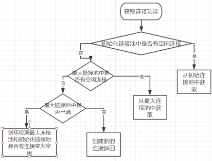

#链接池项目设计文档
##需求分析
    传统的使用JDBC连接数据库的方式在对MySQL请求较多的时会出现频繁的创建链接和销毁连接的过程这对资源的利用率是很低的，并且创建连接销毁连接都需要消耗时间。如果在实际项目开发中使用这种方式将会对整个项目的效率产生极大的影响。
##目标
    解决JDBC在MySQL请求频繁时造成的资源浪费和时间的损耗。
##功能点介绍：
###主要功能：
   
####1.配置数据源
    配置希望与之建立连接数据源信息。
####2.创建链接
    当条件允许时与数据库之间建立连接。
####3.获取连接 
    从链接池中获取连接。
####4.关闭连接
    连接使用完之后归还到链接池中。
####5.销毁连接
    将空闲时间大于我们设定的最大空闲时间的连接直接销毁。
##详细设计
###接口设计
####数据源类   --》 implements DataSource
#####属性
    在设计属性时我们可以参考我们课上学过的数据库链接池。
######（1）driverName;
######（2）url;
######（3）username;
######（4）userpwd;
######（5）initPoolSiz
######（6）maxIdleTime
######（7）maxPoolSize
#####主要功能设计
######数据源信息配置相关的方法。可参考C3P0链接池的使用方式。
   
     当然我们也可以提供相应的构造函数。
            
####链接池类：
#####属性：
    这个类中属性的设计我们要根据自己设计的连接功能去设计，上课时会详细说明。
######（1）连接数据库用的数据源对象
######（2）用来记录maxidletime超时时间，释放多余的连接，连接池保证初始连接量就可以
######（3）存储initPoolSize的连接，因为连接池最起码保证这些连接是存活的，因此单独存放
######（4）存储连接池中额外生成的连接，由于这里面的连接超时以后，需要回收，因此使用高并发链表存储
#####主要功能设计
######（1）getConnection（）方法实现流程
   

######（2）定时清理
    链接池中的连接不会因为调用close方法关闭但是当连接空闲存活的时间超过我们给定的空闲存活的最大的时间之后需要关闭这些空闲存活的连接。所以我们需要一个定时任务，每隔链接池的最大存活时间对链接池中的连接进行一次清理所以我们需要一个定时任务。
    这个定时任务：
    会先判断这个连接是否处于空闲状态，如果是则使用应当前时间减去这一个连接创建的时间如果这个差值大于了最大空闲时间则应该将这个连接将链接池中清除出去并且调用jdbc给我们提供的close方法关闭连接。注意：这次的关闭是真正的关闭。需要在自定义连接的类中再实现一个释放连接的方法这个方法会真正调用连接的close方法。

####连接类： ----》implements Connection
#####属性：
    这个类中属性的设计我们要根据自己设计的连接功能去设计，上课时会详细说明。
######（1）数据源信息
######（2）连接序号
######（3）标记是否空闲
######（4）该链接最后使用的时间（用来判断这个连接的空闲是否已经超时）
#####主要功能设计
######（1）创建连接的方法
	    调用发生在链接池初始化的时候，实现应该在连接类中。  
    用传统的jdbc创建连接的方式先创建initSize个连接放到initSizeConnQueue中。
######（2）关闭连接方法
    模拟连接池关闭连接的特点——并不是真正的关闭而是将是使用完的连接放回到链接池当中。
    实现流程：
    我们在之前设计的时候就给每一个连接设计了一个状态。当关闭连接时我们先将这个连接状态空闲。由于关闭连接的close()方法是Connection接口中的方法。使用自定的Connection类继承Connection类实现，这个类就是每一个连接的实体类，这个close方法在这个类中的实现就是将当前连接的状态为置为false表示空闲。
##项目录屏地址
    链接：https://pan.baidu.com/s/1XWiJsbWochggr8K6G5eWKw 
    提取码：108s 

